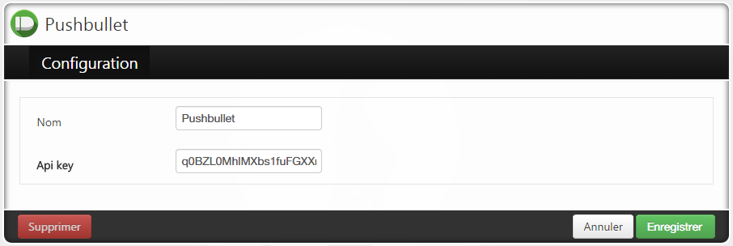
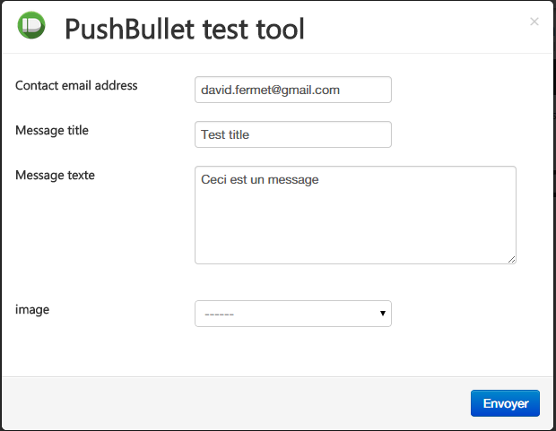

********************
Pushbullet connector
********************

    The pushbullet connector can
        * send notes (title, text) to any registered user
        * send images (title, text, image) to any registered user

Account setup
=============

You need to create an account on Pushbullet and install the application on every
phone / web browser / tablet.

1. Visit `www.pushbullet.com <http://www.pushbullet.com>`_ 
2. Retrieve your **Access Token** in the `api section <https://www.pushbullet.com/account>`_ 

Surycat configuration
=====================

1. Pick the Pushbullet connector from the store 
2. Set an optional custom name and enter the Access Token your retrieved
from the `api section <https://www.pushbullet.com/account>`_ of your account

+--------------------------------------------------------------+-----------------------------------------------+
| Pick                 | .. image:: images/pushbullet_connector.png |
+==============================================================+===============================================+
|                        |     |
|                               |                                               |
|  |                                               |
| of your account                                              |                                               |
+--------------------------------------------------------------+-----------------------------------------------+
| Save                                                         |                                               |
+--------------------------------------------------------------+-----------------------------------------------+

Test
====

Use the connector test tool to send a test notification

Useage
======

Users can be created in the Address Book with the media type *Pushbullet*.
These users will receive notifications with text (and image, if any) as long as
they are part of the group used in a workflow 

