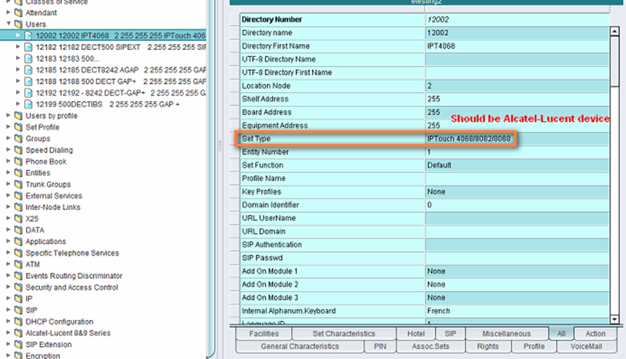
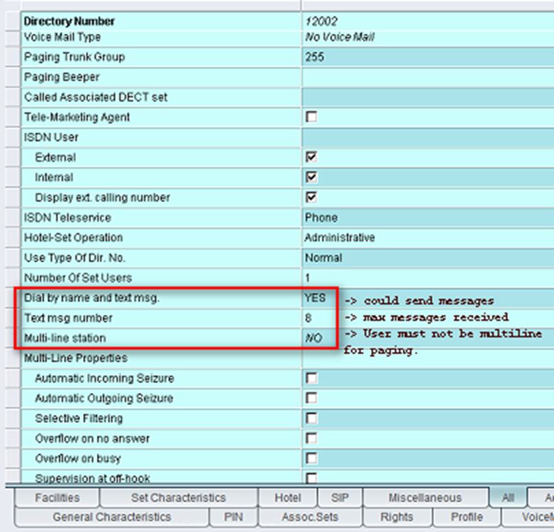
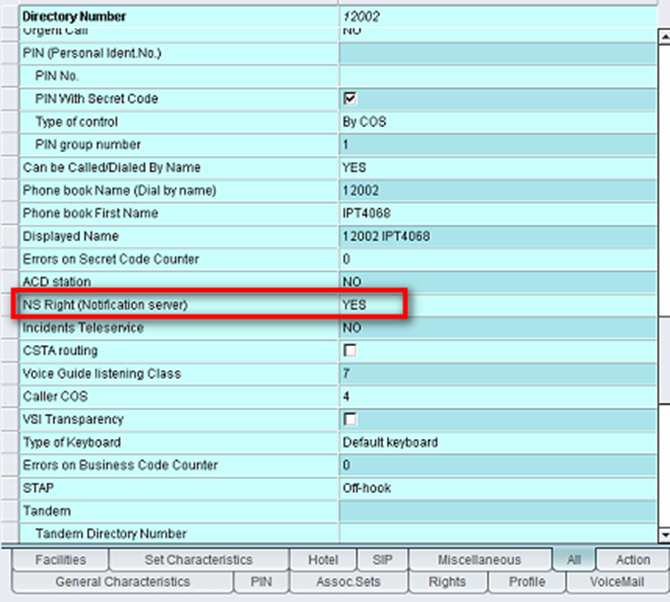
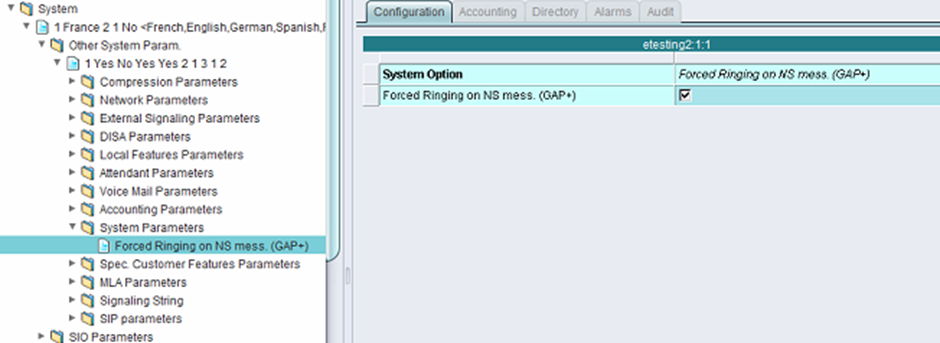
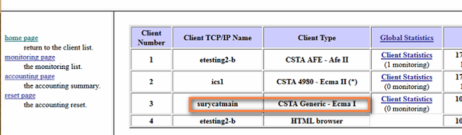

************************
Alcatel Paging Interface
************************

Management of users
===================

This feature Paging is only compatible with Alcatel-Lucent Enterprise devices (use of proprietary protocol).
It could be validated on all IPTouch series 8/9, Mobile IPTouch 81xx, 400/8232/8242DECT, OTCT for MyICPhone (8082 with NOE protocol), IPTouch 3G 80xx.

The user must not be Multiline in order to ge access to this feature Historical limitation.

Use of Omnivista 8770 Network Management Center to manage the OmniPCX Enterprise parameters.

Management of System Parameter for NS
=====================================

“Forced ringing on NS mess. (GAP+)” If Yes the set will always ring while receiving alarm NS otherwise if No it rings according to ringing profile.

Check system license
====================

Use spadmin command to check software license installed in your OmniPCX Enterprise:

Option 1 –  Display current counters

Look for “Notification Server”
::

    Flow Metering on Ethernet : 1
    4635 users                : 1
    Automatic directory pop-up: 255
    Notification Server       : 60     Value should be 50 at least and upper
    FAX server ABC-A link     : 6
    Roaming DECT/PWT          : 0
    Voice guide record from Reflexes: 1
    Ubiquity Counter          : 0 

Option 2 –  Display active file
::

    82   Nb of DECT terminals                =             40
    83   Flow Metering on Ethernet           =              5
    84   4635 users                          =             10
    86   Automatic directory pop-up          =             20
    87   Beta Test                           =             23
    89   Notification server                 =             60
    90 M Roaming DECT/PWT                    =           0/10
    91   Voice guide record from Reflexes    =              1

Maintenance
===========

Check the TCP-IP connection using netstat command:
::

    netstat -an |grep 2555

    tcp        0      0 0.0.0.0:2555            0.0.0.0:*           LISTEN
    tcp        0      0 10.10.10.12:2555        10.10.10.12:10012   ESTABLISHED
    tcp        0      0 10.10.10.12:10012       10.10.10.12:2555    ESTABLISHED
    tcp        0      0 10.10.10.11:2555        10.1.2.53:50665     ESTABLISHED

Check the CSTA connection 
using a browser and url: http://oxe-fqdn/csta_mono or http://oxe-IPaddress/csta_mono

